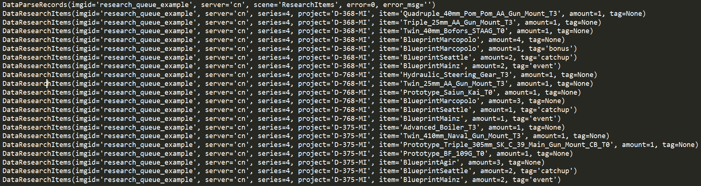

# Azur Stats Server

Backend of https://azur-stats.lyoko.io/


## 统计局后端简单使用

```python
from AzurStats.azurstats import AzurStats
az = AzurStats(r'./doc/research_queue_example.png')
for d in az.DataParseRecords:
    print(d)
for d in az.DataResearchItems:
    print(d)
```


